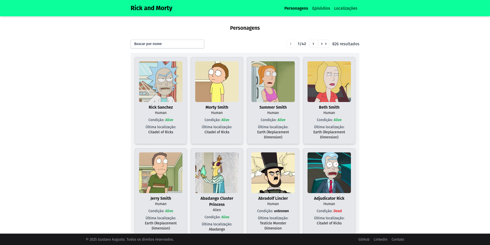
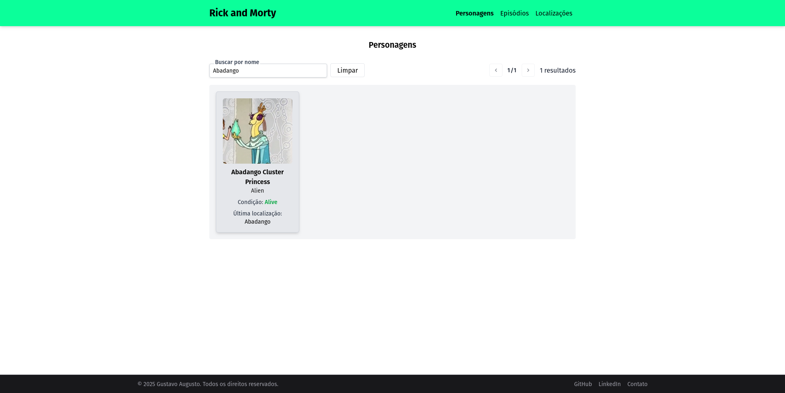
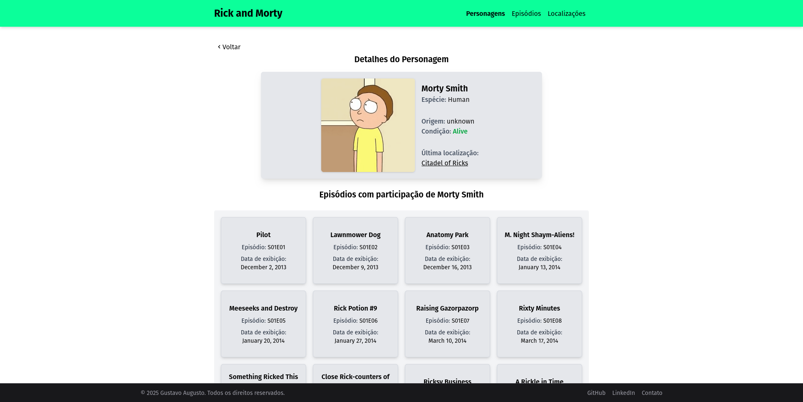
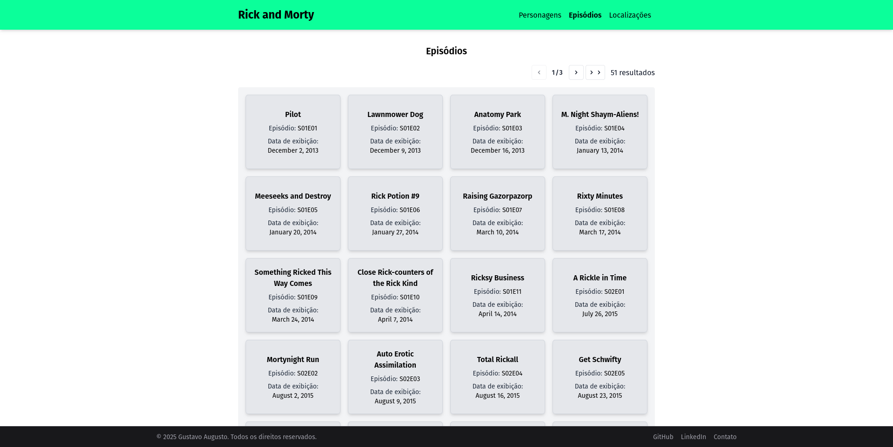
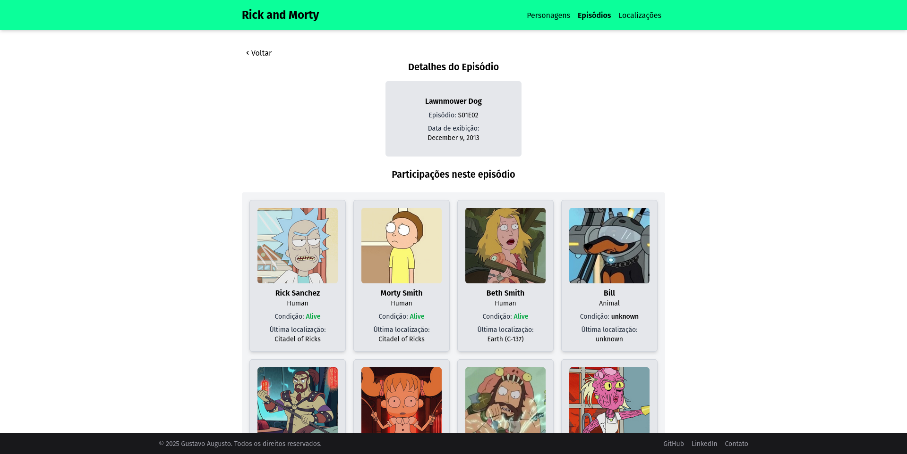
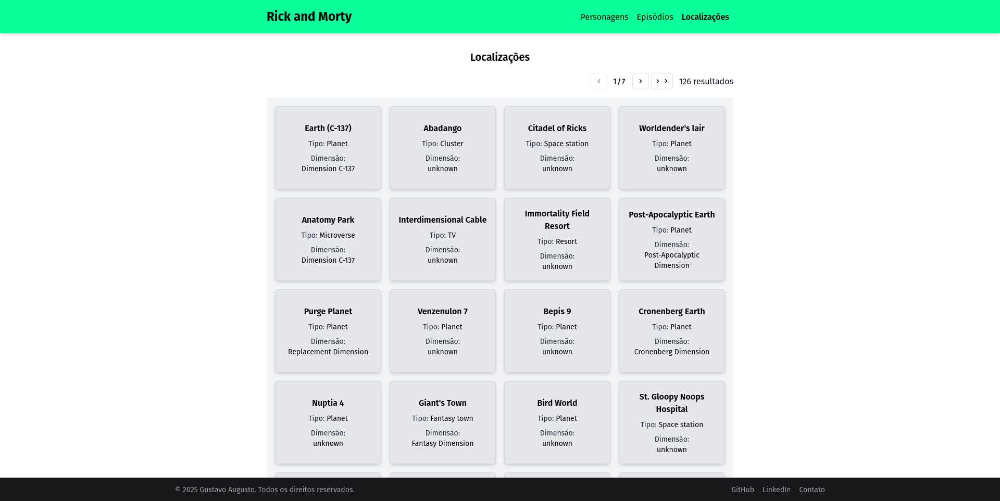
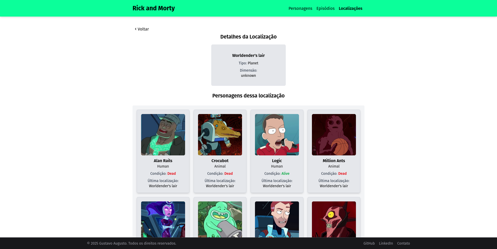

# Rick and Morty Vite

Aplicação web feita com **React 19**, **Vite**, **Tailwind CSS**, **TanStack Router**, **React Hook Form** e **Zod**, consumindo a [API pública do Rick and Morty](https://rickandmortyapi.com/).

> Projeto desenvolvido para portfólio com foco em boas práticas, performance e DX moderna.

---

## 🔥 Tecnologias e ferramentas

- [React 19](https://react.dev/)
- [Vite 7](https://vitejs.dev/)
- [Tailwind CSS 4](https://tailwindcss.com/)
- [TanStack Router](https://tanstack.com/router/latest)
- [React Hook Form](https://react-hook-form.com/)
- [Zod](https://zod.dev/)
- [TypeScript](https://www.typescriptlang.org/)
- [Axios](https://axios-http.com/)
- [Biome](https://biomejs.dev/) (lint, format, fix)

---

## 📦 Instalação

```bash
# Clone o repositório
git clone https://github.com/ferrgusttavo/rickmorty-vite.git

# Acesse a pasta do projeto
cd rickmorty-vite

# Instale as dependências
npm install

# Rode o projeto localmente
npm run dev

# Acesse dentro do seu navegador
http://localhost:5173
```

## 📸 Preview

### Página inicial - Lista de Personagens



### Filtro por nome



### Detalhes do Personagem



### Lista de Episódios



### Detalhes de Episódio



### Lista de Localizações



### Detalhes da Localização


